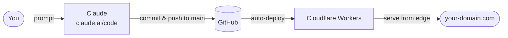

# Build Your Personal Site with Claude

Build and ship a personal website by describing what you want in plain language — no coding required. This is vibe coding: instead of writing code yourself, you prompt Claude to design, build, and update your site for you. Claude handles the files, commits, and deployment while you focus on what you want to say and how you want it to look. Hosted for free on Cloudflare Workers.

## How it works



## Setup

These steps are one-time and done in the Cloudflare dashboard and GitHub.

1. **GitHub** — Create a repo. This is the source of truth for all code and
   content.

2. **Cloudflare account** — Sign up at cloudflare.com (free tier is
   sufficient).

3. **Domain** — Add your domain to Cloudflare by copying your existing DNS
   records and updating your nameservers to point to Cloudflare. The domain
   must be on Cloudflare's DNS for Workers routing to work.

4. **Create a Worker** — In the Cloudflare dashboard go to **Workers & Pages
   → Create → Worker**. Give it a name matching `wrangler.jsonc`.

5. **Connect to GitHub** — In the Worker's settings go to **Settings →
   Build** and connect the GitHub repo. Set the production branch to `main`.
   From this point on, every push to `main` auto-deploys.

6. **Configure the custom domain** — In the Worker go to **Settings →
   Domains & Routes → Add Custom Domain**. Add your domain (e.g.
   `www.example.com`). Cloudflare automatically provisions an SSL certificate
   and routes traffic.

7. **Disable the workers.dev subdomain** *(optional)* — Under **Settings → Domains &
   Routes**, disable the `*.workers.dev` URL. Also set `workers_dev: false`
   in `wrangler.jsonc` so deploys don't re-enable it.

8. **WAF rule** *(optional)* — In the Cloudflare dashboard go to **Security → WAF →
   Custom rules** and create a rule (action: Managed Challenge) to suppress
   bot scanner noise before it reaches the worker:

   ```
   (http.request.uri.path contains "wp-")
   or (http.request.uri.path contains ".php")
   or (http.request.uri.path contains ".env")
   or (http.request.uri.path contains "/.git")
   or (http.request.uri.path contains "xmlrpc")
   or (http.request.uri.path contains "phpmyadmin")
   or (http.request.uri.path contains "phpinfo")
   or (http.request.uri.path contains "/.aws")
   or (http.request.uri.path contains "/.ssh")
   or (http.request.uri.path contains "/cgi-bin")
   or (http.request.uri.path contains "/autodiscover")
   ```

   Blocked requests appear in Security Events, not worker invocation logs.

## CLAUDE.md

`CLAUDE.md` is a reusable instruction file that tells Claude how this
architecture works. To use it for a new site:

1. Copy `CLAUDE.md` into the root of your new repo.
2. Add a `NOTES.md` with your project-specific notes (design, features,
   special components) — see the **Project specifics** section at the bottom
   of `CLAUDE.md` for what to include.
3. Start a Claude session and Claude will follow the instructions in
   `CLAUDE.md` automatically.

This isn't required, but it's recommended. You can also construct your own
`CLAUDE.md` tailored to your setup, or start without one entirely.

## Building your site

Your site is built entirely by prompting Claude — no local development
environment, no terminal, no code editor required.

1. **Claude Pro subscription** — A Claude Pro account is required to access
   Claude on the web.

2. **Design with Claude** — Use Claude Design to create your site's look and
   feel. Describe your style, content, and goals and Claude will produce
   design files you can use as the blueprint for the build.

3. **Initial build** — Launch a Claude Code session connected to this repo and
   share the design files. Claude will build out the initial site — pages,
   styles, and content — and push to `main`. Cloudflare deploys automatically.

4. **Iterate** — Continue prompting Claude to add pages, update content, tweak
   the design, or add new features. Each change is committed and live within
   seconds.

## Sample prompts

These examples show the kinds of things you can ask Claude to do once your
site is set up.

**Adding content**
- "Add a now entry: just got back from a week in the mountains."
- "Add a new curations category called 'Books' with a first item: Thinking in Systems by Donella Meadows, a classic introduction to systems thinking."
- "Update my bio in the about page to mention I moved to Portland."

**Building new pages**
- "Add a /now page that shows a reverse-chronological list of short status updates stored in now.json."
- "Create a /curations page with categories stored in curations.json. Each category links to its own page listing items with titles, URLs, and descriptions."
- "Add a /uses page listing the hardware and software I use daily."

**Design and layout**
- "The homepage feels too sparse — add a subtle animated SVG illustration of the Maine coast."
- "Make the type on the curations pages larger and increase line spacing for readability."
- "Add a dark/light mode toggle that persists across sessions."

**Features and data**
- "Pull live tide data from NOAA for my local gauge and display it on the homepage."
- "Show current weather conditions using Open-Meteo — temperature and a short description."
- "Add a /feed.xml RSS feed for my now entries."

**Maintenance**
- "Audit the site for any dead code or unused assets and remove them."
- "Review the CSP headers and tighten anything that's too permissive."
- "Update llms.txt to reflect the current state of the site."
