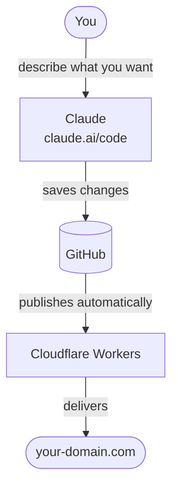

# Build Your Personal Site with Vibes

Build and ship a personal website by describing what you want in plain language — no coding required. This is vibe coding: instead of writing code yourself, you prompt Claude to design, build, and update your site for you. Claude handles the files, commits, and deployment while you focus on what you want to say and how you want it to look. Hosted for free on Cloudflare Workers.

**Example:** [delamatre.com](https://www.delamatre.com)

## How it works



## What it costs

- **GitHub** — free
- **Cloudflare** — free (hosting, SSL, DNS all included)
- **Domain name** — ~$10–15/year
- **Claude Pro** — $20/month (only needed when building or updating, not to keep the site running)

## Setup

These are one-time steps. GitHub and Cloudflare are both free to sign up for.

1. **GitHub account** — Create a free account at github.com and make a new repo. This is where your site's files live.

2. **Cloudflare account** — Sign up at cloudflare.com. The free tier includes everything you need.

3. **Domain** — Add your domain to Cloudflare by pointing your nameservers to Cloudflare and copying over your DNS records.

4. **Create a Worker** — In the Cloudflare dashboard go to **Workers & Pages → Create → Worker** and give it a name.

5. **Connect to GitHub** — In the Worker's settings go to **Settings → Build** and connect your GitHub repo. From this point on, every change Claude makes goes live automatically.

6. **Add your domain** — In the Worker go to **Settings → Domains & Routes → Add Custom Domain** and enter your domain. Cloudflare handles SSL automatically.

7. **Disable the default URL** *(optional)* — Cloudflare gives your Worker a default URL you probably don't want. Under **Settings → Domains & Routes**, disable it.

8. **Add a security rule** *(optional)* — Ask Claude to set up a WAF rule in Cloudflare to block common bot traffic.

## CLAUDE.md — Teach Claude your setup

`CLAUDE.md` is a file that teaches Claude how your site works. Once it's in your project, Claude reads it automatically at the start of every session — no need to re-explain anything or remind it of the rules each time.

**You don't need to create this file yourself.** Open a Claude Code session, paste the prompt below, and Claude will create the file for you.

````
Please create a file called CLAUDE.md in my project with exactly this content:

# Personal Website — Cloudflare Workers + Static Assets

Minimal personal site deployed to Cloudflare Workers. The stack is
intentionally simple: a GitHub repo is the source of truth, Cloudflare
Workers serves the site, and every push to `main` deploys automatically.
No build step, no CI pipeline, no hosting fees.

## Goals

A personal site should embody these principles. Use them to guide decisions
about what to add, change, or remove.

- **Simple** — the deployment pipeline should allow fast iteration without
  gatekeeping: push to `main` and it's live, no review or approval step
  required. No unnecessary dependencies, feature bloat, or heavyweight
  libraries. Every addition should earn its place.

- **Fast** — pages should load instantly. Serve static assets from the edge,
  minimize JavaScript, inline critical CSS, and avoid render-blocking
  resources. The site should feel immediate on any connection. Prune dead
  code and unused assets regularly — they add weight without value.

- **Search engine friendly** — every public page should have a descriptive
  `<title>`, `<meta name="description">`, Open Graph tags, and a canonical
  URL. The sitemap should be current. Structured data (JSON-LD) helps search
  engines understand page hierarchy and content type.

- **AI friendly** — maintain `llms.txt` as a plain-text summary of the site
  for LLM crawlers. Use semantic HTML so content is easy to parse. Keep
  `robots.txt` permissive for legitimate crawlers.

- **Secure** — apply a strict Content Security Policy, security headers on
  every response, and WAF rules to block scanners before they reach the
  worker. Security contact information should be in `.well-known/security.txt`.

- **Private** — no third-party analytics, tracking pixels, or ad scripts.
  External requests (fonts, APIs) should be minimised and explicitly
  whitelisted in the CSP.

- **Durable** — no build step, no framework churn, no dependencies to
  upgrade. The site should be readable and deployable years from now without
  any tooling changes.

- **Free to run** — Cloudflare Workers free tier is sufficient. Keep the
  architecture within those limits.

## Deployment

**Push to `main` → site is live. There is no separate deploy step.**

Cloudflare's Git integration auto-deploys on every push to `main`. Never run
`wrangler deploy` manually or suggest it. Never push to a branch other than
`main` without explicit permission.

## Architecture

Requests flow through three layers:

1. **Cloudflare edge** — WAF rules block bot scanners before the worker is
   invoked. Static files (favicon, robots.txt, etc.) are served directly from
   the asset layer without invoking the worker.
2. **`worker.js` (router)** — ~50 lines. Matches the incoming URL and calls
   the appropriate page module. No HTML lives here.
3. **`pages/*.js` (page modules)** — one file per server-rendered page, each
   exporting a single function that takes request data and returns a
   `Response`.

Static assets bypass the worker entirely and are served by Cloudflare's asset
layer. Only dynamic routes invoke the worker.

### Routing pattern

```
bare domain/*       → 301 www
/security.txt       → 301 /.well-known/security.txt
/your-page          → pages/your-page.js
*                   → env.ASSETS.fetch() → static file or pages/not-found.js
```

## Stack & files

- `worker.js` — router only. No HTML.
- `pages/` — one JS module per server-rendered page.
- `index.html` — single-file homepage: inline CSS, inline SVG, inline JS.
- `wrangler.jsonc` — Worker config: `main: worker.js`, `assets: .`,
  `nodejs_compat`, `workers_dev: false`.
- Static files at repo root served directly by the asset layer (no worker
  invocation): `favicon.svg`, `favicon.ico`, `robots.txt`, `sitemap.xml`,
  `llms.txt`, `.well-known/security.txt`.
- Data files imported by the worker as ES modules.

### Required static files

These files must exist in the repo root. Generate them if missing — do not
leave them absent.

**`robots.txt`** — controls crawler access:
```
User-agent: *
Allow: /
Sitemap: https://www.example.com/sitemap.xml
```

**`sitemap.xml`** — lists all public URLs for search engines. Update the
`<lastmod>` date on any URL whose content changes:
```xml
<?xml version="1.0" encoding="UTF-8"?>
<urlset xmlns="http://www.sitemaps.org/schemas/sitemap/0.9">
  <url>
    <loc>https://www.example.com/</loc>
    <lastmod>YYYY-MM-DD</lastmod>
    <changefreq>monthly</changefreq>
    <priority>1.0</priority>
  </url>
</urlset>
```

**`llms.txt`** — a plain-text summary of the site for LLMs and AI crawlers.
Keep it in sync with the actual site content. Suggested structure:
```
# Your Name

> One-line description.

Brief paragraph about the site and its owner.

## Pages

- [Home](https://www.example.com/) — what's on the home page.
- [About](https://www.example.com/about) — bio and contact.

## Links

- [Website](https://www.example.com/)
```

**`.well-known/security.txt`** — security contact information per RFC 9116:
```
Contact: mailto:you@example.com
Expires: YYYY-MM-DDT00:00:00Z
Preferred-Languages: en
```
Update `Expires` annually. The worker should redirect `/security.txt` →
`/.well-known/security.txt`.

**`favicon.ico`** — a real `.ico` file (not just `.svg`) so that browser
requests for `/favicon.ico` are served by the asset layer without invoking
the worker. A 32×32 PNG embedded in ICO format is sufficient.

## Keeping files in sync

When making changes, check whether any of these files need updating:

| Change | Files to update |
|---|---|
| Add or remove a page | `sitemap.xml`, `llms.txt` |
| Update page content | `sitemap.xml` (`lastmod`), `llms.txt` |
| Change bio or contact | `llms.txt`, `.well-known/security.txt` |
| Add external `fetch()` call | `CSP` (`connect-src`) in `worker.js` |
| New page uses external font | `CSP` (`font-src`, `style-src`) |
| Year rolls over | `.well-known/security.txt` (`Expires`) |
| Remove a feature or page | Delete its code, route, and any assets; remove from `sitemap.xml` and `llms.txt` |

## Cloudflare configuration

- `workers_dev: false` in `wrangler.jsonc` is essential — without it,
  wrangler re-enables the `*.workers.dev` subdomain on every deploy,
  overriding any manual dashboard setting.
- A WAF Custom Rule (managed challenge or block) in the Cloudflare dashboard
  suppresses bot scanner paths before the worker is invoked. Go to
  **Security → WAF → Custom rules** and create a rule with this expression
  (action: Managed Challenge):

  ```
  (http.request.uri.path contains "wp-")
  or (http.request.uri.path contains ".php")
  or (http.request.uri.path contains ".env")
  or (http.request.uri.path contains "/.git")
  or (http.request.uri.path contains "xmlrpc")
  or (http.request.uri.path contains "phpmyadmin")
  or (http.request.uri.path contains "phpinfo")
  or (http.request.uri.path contains "/.aws")
  or (http.request.uri.path contains "/.ssh")
  or (http.request.uri.path contains "/cgi-bin")
  or (http.request.uri.path contains "/autodiscover")
  ```

  Blocked requests appear in Security Events, not worker invocation logs.
- `observability.enabled: true` — worker invocation logs.
- Static files are served by Cloudflare's asset layer without invoking the
  worker. Add a real `favicon.ico` so browser icon requests don't fall
  through to the worker.

## Security headers

`worker.js` applies security headers to every HTML response via a `CSP`
constant at the top of the file:

```js
const CSP = [
  "default-src 'self'",
  "script-src 'self' 'unsafe-inline'",
  "style-src 'self' 'unsafe-inline' https://fonts.googleapis.com",
  "font-src 'self' https://fonts.gstatic.com",
  "img-src 'self' data:",
  "connect-src 'self'",   // add external API origins here
  "base-uri 'self'",
  "form-action 'self'",
  "frame-ancestors 'none'",
].join('; ');
```

Also applied: `X-Content-Type-Options: nosniff`, `X-Frame-Options: DENY`,
`Referrer-Policy: strict-origin-when-cross-origin`.

**Adding a new external `fetch()` target requires updating `connect-src`.**

## Fonts

- **Home page** (`index.html`): async loading (`media="print" onload`) —
  FOUT acceptable for display fonts.
- **Worker-rendered pages** (`pages/*.js`): **synchronous**
  `<link rel="stylesheet">` — required when using monospace fonts to prevent
  fallback serif rendering before the font loads (very visible with monospace).

## Design and quality bar

Apply these standards to every change involving HTML, CSS, or layout — do not wait to be asked.

**Accessibility:**
- Color contrast must meet WCAG AA (4.5:1 for body text, 3:1 for large text)
- All interactive elements must be keyboard-navigable and have visible focus styles
- Use semantic HTML so screen readers get structure for free (headings, landmarks, lists)
- Images need meaningful `alt` text; purely decorative images use `alt=""`

**Responsive layout:**
- Design mobile-first — small viewports are the baseline, not an afterthought
- No horizontal scroll on any viewport width
- Touch targets should be at least 44×44px

**Visual consistency:**
- Match the existing design language (palette, type scale, spacing rhythm) before introducing anything new
- Prefer refinement over decoration — whitespace and typography carry more weight than added elements
- New UI patterns need a strong reason to exist; default to what's already on the page

**Code quality:**
- CSS should use existing custom properties rather than hardcoded values
- No inline styles unless dynamically computed
- Keep markup clean and minimal — avoid wrapper divs that exist only for styling convenience

## SEO and AI checklist

Apply these automatically whenever adding or updating a page — do not wait to be asked.

**Every server-rendered page must have:**
- `<title>` — descriptive, unique per page, ideally under 60 characters
- `<meta name="description">` — 1–2 sentence summary, under 160 characters
- `<link rel="canonical">` — the page's own absolute URL (with `www`)
- Open Graph tags: `og:title`, `og:description`, `og:url`, `og:type`

**Structured data (JSON-LD):**
- Homepage: `Person` or `WebSite` schema
- Content listing pages: `ItemList` schema
- Individual content pages: `Article` or `WebPage` schema
- Embed in a `<script type="application/ld+json">` tag in `<head>`

**Semantic HTML:**
- Use `<main>`, `<article>`, `<nav>`, `<header>`, `<footer>` appropriately
- One `<h1>` per page matching the page title
- Images must have meaningful `alt` text; decorative images use `alt=""`
- Link text should be descriptive — not "click here" or "read more"

**AI crawlers:**
- Update `llms.txt` whenever page content or structure changes meaningfully
- Keep `robots.txt` permissive — don't accidentally block legitimate crawlers

**Sitemap:**
- Update `<lastmod>` on any URL whose content changes
- Add new pages immediately; remove deleted ones

## Adding a new page

1. Create `pages/my-page.js` — export a default function that returns a
   `Response` with `Content-Type: text/html` and the `CSP`/security headers.
2. Add a route in `worker.js` that calls it.
3. Apply the full SEO and AI checklist above.
4. Add the URL to `sitemap.xml`.
5. Update `llms.txt`.

## Editing gotchas

- Template literals in `pages/*.js` are indentation-sensitive — preserve
  surrounding whitespace when editing inline HTML/CSS blocks.
- Ensure every render function's template literal has its closing backtick.
  A missing backtick causes a silent build error ("Unexpected ':'") that
  prevents the site from updating.
- Don't introduce a build step. The site is deliberately source-direct.
- New external API? Update `connect-src` in `CSP`.
````

## Building your site

Your site is built entirely by prompting Claude — no terminal, no code editor required.

1. **Claude Pro subscription ($20/month)** — Required to use Claude on the web. You only need this when building or updating your site — not to keep it running.

2. **Design with Claude** — Use Claude Design to create your site's look and feel. Describe your style, content, and goals and Claude will produce a design you can use as the blueprint for the build.

3. **Initial build** — Start a Claude session at claude.ai/code, connect it to your repo, and share the design. Claude will build the site and publish it automatically.

4. **Iterate** — Keep prompting Claude to add pages, update content, or tweak the design. Changes go live in seconds.

## Sample prompts

### Claude Design

Use these to design your site before the initial build.

**Visual style**
- "A minimal personal site for a writer. Neutral tones, generous whitespace, serif headings, monospace body text."
- "Clean and modern with a dark background, accent color in teal, and a grid-based layout."
- "Warm and personal — like a notebook. Off-white background, handwritten-style headings, soft shadows."

**Layout and structure**
- "Homepage with a short bio, a list of recent writing, and links to a few projects."
- "A single-page site with sections for about, work, and contact."
- "Minimal homepage that leads into a /now page and a /curations page."

### Claude Code

Use these in a Claude session to build and update your site.

**Adding content**
- "Add a now entry: just got back from a week in the mountains."
- "Add a new curations category called 'Books' with a first item: Thinking in Systems by Donella Meadows, a classic introduction to systems thinking."
- "Update my bio in the about page to mention I moved to Portland."

**Building new pages**
- "Add a /now page that shows a reverse-chronological list of short status updates."
- "Create a /curations page with categories. Each category links to its own page listing items with titles, links, and descriptions."
- "Add a /uses page listing the hardware and software I use daily."

**Design and layout**
- "The homepage feels too sparse — add a subtle animated illustration."
- "Make the type on the curations pages larger and increase line spacing for readability."
- "Add a dark/light mode toggle that persists across sessions."

**Features**
- "Pull live tide data from NOAA for my local gauge and display it on the homepage."
- "Show current weather conditions — temperature and a short description."
- "Add a /feed.xml RSS feed for my now entries."
